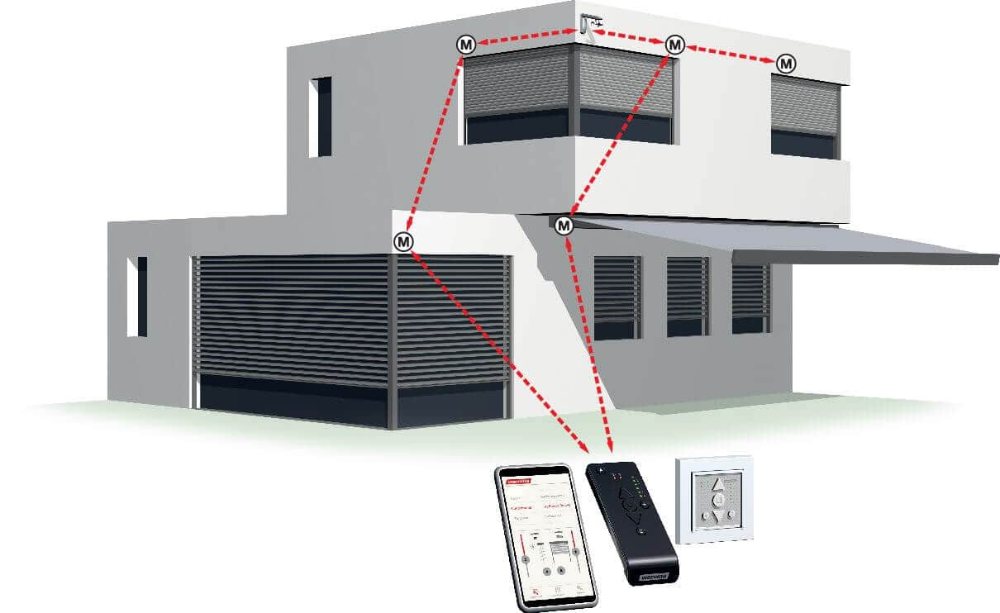

# WAREMA - An home assistant plugin to add and control window awning / ZIP blinds

## Description
This platform plugin allows you to control window awnings / ZIP blinds from the manufacturer Warema (Warema.com). 

## Requirements
You need to have Warema "WMS WebControl pro" installed to your network and have enabled the cloud connect.
"WMS WebControl pro" is a hardware for integrating a mobile end device into the WMS as an additional transmitter. It is operated by app or web browser. The system is operating at home directly via the WLAN network or with a worldwide access via optional cloud connection

Warema window awnings: warema.com
 

WMS WebControl pro: https://www.warema.com/en/control-systems/radio-systems/wms-webcontrol-pro.php

## Installation
y

## Configuration
x
