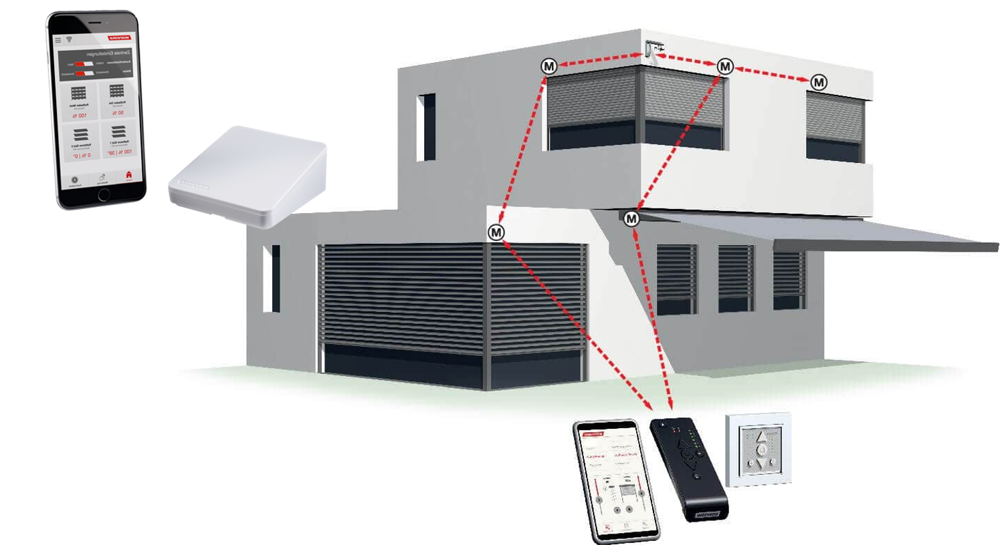

# WAREMA - An home assistant plugin to add and control window awning / ZIP blinds


## Description
This platform plugin allows you to control window awnings / ZIP blinds from the manufacturer [Warema](https://www.warema.com/en/). 
The plugin controls your components via the Warema API.

## Requirements
You need to have Warema [WMS WebControl pro](https://www.warema.com/en/control-systems/radio-systems/wms-webcontrol-pro.php) installed to your network and have enabled the cloud connect.
[WMS WebControl pro](https://www.warema.com/en/control-systems/radio-systems/wms-webcontrol-pro.php) is a hardware for integrating a mobile end device into the WMS as an additional transmitter. It is operated by app or web browser. The system is operating at home directly via the WLAN network or with a worldwide access via optional cloud connection.

[Warema window awnings](https://www.warema.com/en/awning/window-awning.php)


[WMS WebControl pro](https://www.warema.com/en/control-systems/radio-systems/wms-webcontrol-pro.php)



## Installation
### Upgrading from an old component version
* Remove all configuration from Home Assistants config file `configuration.yaml`
* Upgrade the component via HACS or manually replace the files in the custom_component folder (see install manually below)
* Restart Home Assistant
* Add the component again as per below (install + configuration)

### Install with HACS (recommended)
Do you you have [HACS](https://community.home-assistant.io/t/custom-component-hacs) installed? Just search for `Warema` and install it direct from HACS. HACS will keep track of updates and you can easly upgrade Warema to the latest version.

### Install manually
Make sure you have an account on your Warema WMS WebControl pro!

Clone or copy the repository and copy the folder `homeassistant/custom_component/warema` into `<config dir>/custom_components`

## Configuration
* Restart Home Assistant
* Add and configure the component via the UI: `Configuration` > `Integrations` > search for `Warema` and follow the wizard to configure (use your Warema WMS WebControl pro credentials)
* All available components and controls should be added automatically

### Configuration flow settings
Use your "Warema WMS WebControl pro" credentials! Password will be converted to a Bearer access token for the interaction with the Warema API.
* Username 
* Password

## Exposed entities

- `cover.warema_[YOUR-ENTITY-Name]` for each of your Warema window awnings

Note: If you have configured an awning collection entitiy in your App, this will appear as an own cover entity in HA

## Automations

Save these automations in your automations file `<config dir>/automations.yaml`

### Close covers when the sun is shining and temperature is above 21°
```yaml
- id: notify_volkswagen_position_change
  description: Notify when position has been changed
  alias: VW position changed notification
  trigger:
    - platform: state
      entity_id: device_tracker.vw_carid
  action:
    - service: notify.ios_my_ios_device
      data_template:
        title: "Passat GTE Position Changed"
        message: |
          🚗 VW Car is now on a new place.
        data:
          url: /lovelace/car
          apns_headers:
            'apns-collapse-id': 'car_position_state_{{ trigger.entity_id.split(".")[1] }}'
          push:
            category: map
            thread-id: "HA Car Status"
          action_data:
            latitude: "{{trigger.from_state.attributes.latitude}}"
            longitude: "{{trigger.from_state.attributes.longitude}}"
            second_latitude: "{{trigger.to_state.attributes.latitude}}"
            second_longitude: "{{trigger.to_state.attributes.longitude}}"
            shows_traffic: true
```

## Limitations
Please be aware that at this time the plugin only adds and controls window awnings. Support for e.g. Raft-Stores is not implemented yet due to the lack of being able to test it.

## To be done
1. Parse room name from WMS and add it to HA
2. Add preconfigured scenes

## Credits
Thanks a lot to Stefan Ruf from Warema who supported the development of this plugin
